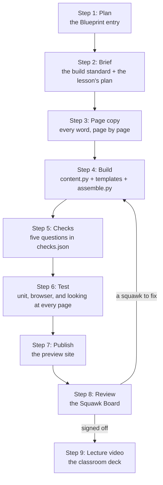

# Build: how the CAET avionics course is made

Written 2026-10-01 by Nick Brown's course team. This section is for instructional designers who want to understand
the method and the tools behind the CAET course, and repeat them for their own subject.

**CAET** is the Certified Avionics Electronics Technician certification of the Aircraft Electronics Association
(AEA). The course that prepares students for it has about 54 lessons in 14 topic rooms, from Shop Safety to
Surveillance. Each lesson is a web page that moves left to right, one idea per page, built to one written standard.
The same lessons open from two front doors: a 3D training hangar students walk through, and a plain course library.

The rest of this library (sections 01 to 07) explains why a teaching move works. Section 08, Lesson Craft, explains how
each interaction, figure, animation and 3D scene should look and behave. This section explains how a lesson is
actually produced: the order of the work, the files, the tools and the checks.

## The pipeline on one page

If the diagram does not draw where you are reading this, here is the same picture as a list: plan, brief, page copy,
build, checks, test, publish, review (fixes go back to build), lecture video.

| Step | What happens | Who does it | What comes out | Guide |
|---|---|---|---|---|
| 1. Plan | The lesson gets its place in the course: scope, objectives tied to CAET codes, prerequisites, a page plan, a status (rebuild, keep-light, split, new, merge) | Planner, then the course owner approves | One entry in a Blueprint plan file | [method.md, step 1](method.md#step-1-plan) |
| 2. Brief | The builder reads the one build standard and the lesson's Blueprint entry. A rebuild also inventories the old lesson and gets a storyboard approved | Builder (a person or an AI agent) | A tagged inventory and an approved storyboard | [method.md, step 2](method.md#step-2-brief) |
| 3. Page copy | Every page is written out: label, plain heading, goal, the exact on-screen words, the interaction, the sources | Builder, in the owner's voice | `page-copy.md` | [method.md, step 3](method.md#step-3-page-copy) |
| 4. Build | Words go in `content.py`, page layouts in templates, and one script assembles the lesson page | Builder | The lesson HTML | [lesson-format.md](lesson-format.md) |
| 5. Checks | Five check questions, one per objective focus, with a teaching line for every option | Builder | `checks.json`, applied by a script | [method.md, step 5](method.md#step-5-checks) |
| 6. Test | Unit tests, a browser test that walks every page on a desktop and a phone, and a person looking at every screenshot | Builder | Passing tests and a review packet | [tooling-and-publishing.md](tooling-and-publishing.md) |
| 7. Publish | The preview site is rebuilt from committed files | Course owner only | The lesson live on the preview | [tooling-and-publishing.md, publishing](tooling-and-publishing.md#publishing-the-preview) |
| 8. Review | The owner reads each page on a phone and writes a squawk (a review note) against any page; each squawk is fixed and signed off | Owner, then builder | Every page signed off | [method.md, step 8](method.md#step-8-review-on-the-squawk-board) |
| 9. Lecture video | The classroom lecture for the lesson is written and re-cut to match the final lesson | Deck builder | A narrated deck the hangar and the lesson both play | [hyperframes.md, classroom decks](hyperframes.md#use-2-classroom-lecture-decks) |

## The guides in this section

| Guide | What it covers |
|---|---|
| [method.md](method.md) | The CAET lesson method in steps: page order, one idea per page, the writing rules, the check rules, the review, and what the owner approved and rejected |
| [lesson-format.md](lesson-format.md) | The paged lesson format, the shared parts (pager, sort, ask card, flip, hotspot, reader, lecture player, knowledge check), how `assemble.py` builds a lesson, and how a new lesson starts |
| [sims-circuit-lab.md](sims-circuit-lab.md) | The Avionics Circuit Lab: presets, the lab page wrapper, `autoSolve`, completion messages, the Harness Bench, and how to add a lab |
| [models-and-3d-pipeline.md](models-and-3d-pipeline.md) | Where the 3D models come from: the tools3d registry, procedural builds, GLB files, still pictures |
| [cardcraft.md](cardcraft.md) | CardCraft, the library of single teaching cards, and its public extract |
| [hyperframes.md](hyperframes.md) | HyperFrames, which renders HTML to video: short lesson clips and the classroom lecture decks |
| [scrollcraft.md](scrollcraft.md) | Scrollcraft, a scroll-driven page builder, and the one idea from it that fits a lesson |
| [hangar.md](hangar.md) | The 3D Training Hangar and the classic course library: two front doors to the same lessons |
| [skills.md](skills.md) | The AI agent skills used in this workflow, one line each, and which ones come with this library |
| [tooling-and-publishing.md](tooling-and-publishing.md) | Tests, the local test server, publishing the preview, and publishing this library with GitHub Pages |

## Words used in this section

| Word | Meaning here |
|---|---|
| Repo | A repository: a project folder tracked by git, usually also on GitHub |
| Agent | An AI coding assistant (Claude Code, Codex and similar) that reads files, runs commands and writes code |
| Skill | A folder of written instructions an agent loads when a task matches it (see [skills.md](skills.md)) |
| Blueprint | The course plan: every lesson, its objectives, prerequisites and page plan |
| Page copy | The exact words of every page, written before anything is built |
| Template | A file of page HTML with named gaps that a script fills |
| Assemble | Run the lesson's `assemble.py`, which writes the finished lesson page |
| Pager | The shared script that turns a lesson into pages with one header, a side panel and Continue |
| Preset | One saved circuit or lab in the Avionics Circuit Lab, stored as data |
| GLB | The binary file format for a 3D model (glTF) |
| Deck | A classroom lecture: two narrated instructors with animated whiteboard scenes |
| Squawk | Aviation word for a reported defect. Here, one review note against one page |

## Where things live

Most of the source is in private repositories. The guides quote the parts you need, so you can repeat the method
without access.

| Thing | Where | Public? |
|---|---|---|
| Lessons, shared lesson parts, the Blueprint, the build standard, the hangar, tests | The CAET course repo (`aero-caet-source`) | Private |
| One lesson's build files | The course repo, `tools/curriculum/revamp/examples/<lesson-id>/` | Private |
| The Avionics Circuit Lab and the Harness Bench | The Circuit Lab repo (`aero-circuit-lab`) | Private |
| Tool models made in Blender | The 3D tools repo (`avionics-tools-3d`) | Private |
| CardCraft cards and the Card Studio | The CardCraft repo (`cardcraft`) | Private |
| Gold cards, card catalog, audit and authoring skills, a lint tool | The `html-training-craft` repo, being folded into this library | Public, MIT |
| HyperFrames | `github.com/heygen-com/hyperframes` | Public, Apache-2.0 |
| Scrollcraft | `github.com/nateherkai/scroll-craft` | Public, MIT |
| Lesson Craft notes (how each part should look and teach) | This library, [`../craft/`](../craft/) | Public |

## Rules every step follows

- **One standard.** Every builder reads the same build standard before writing a word ([method.md](method.md)).
- **Plain words.** Technical instruction in the style of a Navy training manual. Plain noun headings. No slogans. No
  em or en dashes.
- **Real sources.** FAA handbook figures, real regulations, real forms, real data sheets, each credited on the page.
- **Keep what works.** A rebuilt lesson lifts its working simulations and real schematics from the original. It never
  replaces them with a drawing.
- **Phone first.** The owner reviews on a phone. Every page is tested at 390 pixels wide and looked at.
- **The owner publishes.** Builders build, test and hand over. Only the course owner publishes or merges.
